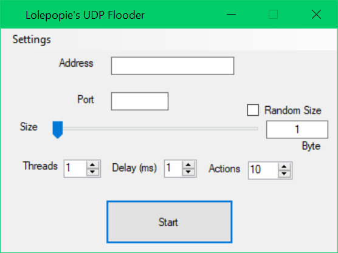
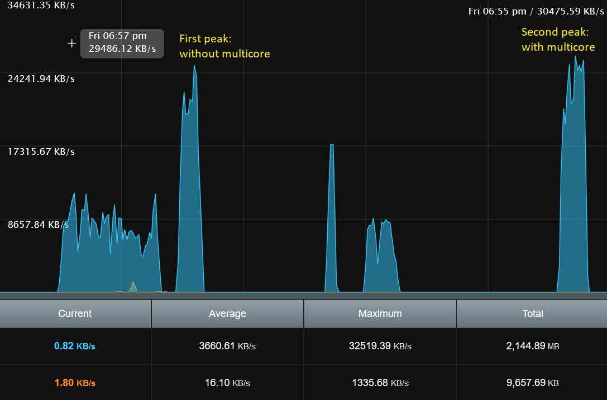

## Lolepopie's UDP Flooder
Simple UDP stress tester with simple controls.

## Features
-Minimise to system tray

-Make the window Disappear when starting

-Right clicking on icon(black square for some reason) in system tray will close the program

-Byte counter (Will crash the program if settings are cpu intensive)

-Virtually no limits to settings (For practical use)

-Multicore support (Not sure about how much better this is than normal)

Multicore test with same settings

All settings in the "Settings" tab are off by default and can be toggled at the top of the window

## Disclaimer
I am not responsible for any damage you cause or trouble you get yourself into using this program.
